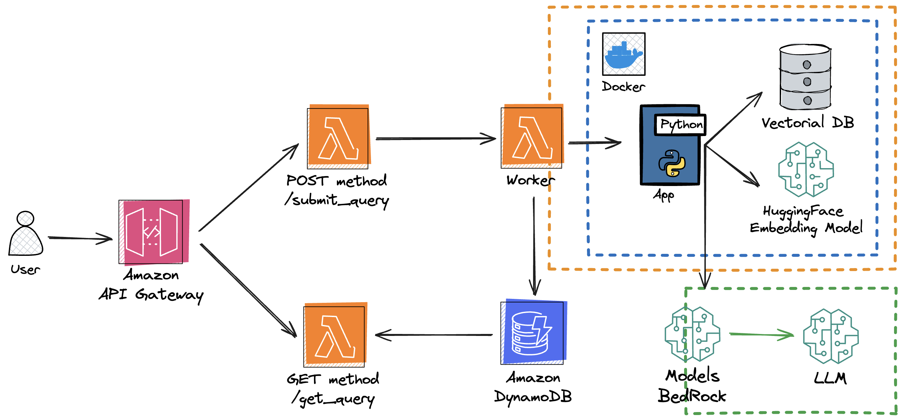

# Refugee chatbot

This is the code used by the *refugee chatbot*.

Its objective is to help refugees recently arrived to Spain, with any question
that they may have related to their status, their needs, etcetera.

Under the hood, the chatbot is powered by an Large Language Model, uses the RAG
methodology, which consists of:

- *R*etrieval of information from documents
- *A*ugmentation of context based on information
- *G*eneration of response based on the context

A part from this novel methodology, the chatbot is defined and implemented by a
decision graph, that contains all the internal process followed by it at
receiving a new question.

This internal graph contains more logic than a standard RAG process, handling
language and context in a specific way.

Configuration parameters are specified in two **YAML** files:

- *config/main.yaml*: High-level parameters (you can edit them when you want to try some different configurations)
- *config/settings.yaml*: Low-level parameters (you should not, or very rarely, need to modify them)

## Pipelines

Pipelines have been created to execute processes with a defined beginning and end.

To execute them is necessary to set up the environment first with the following commands:
- Create a virtual environment
  ```shell
  python3 -m venv .venv
  ```
- Activate the virtual environment
  ```shell
  source .venv/bin/activate
  ```
- Install the required packages
  ```shell
  pip install -r config/requirements.txt
  ```

 There are four pipelines implemented:

1. **index_documents**: reads raw txt documents, creates embeddings, and stores them in a newly created Chroma vector database. To execute you just have to run:
    ```shell
    (.venv) make index_documents
    ```

For any change seeking improvement to the quality of the chatbot, it is
recommended to test its quality with the evaluation process that has already
been developed.

This process works in the following way:

- For each of the questions in the reference dataset, answer them using the new
  version of the chatbot

- Then, compute the overall metric given all answers and comparing them to the
  ideal answers from the reference dataset

The way to execute the evaluation process is executing the following two pipelines, assuming that the environment is properly set up:

First, decide a name for the new version, and update the following keys from
*config/main.yaml* file with it: `generate_answers[version_name]` and
`evaluate[answers][chatbot]`. For example, if the new version is called
"test-new-model", the former parameter would be "test-new-model" and the
latter, "reports/executions/test-new-model/answers.csv"

2. **generate_answers**: Execute the process to generate all answers for the reference dataset:
    ```shell
    (.venv) make generate_answers
    ```
    The answers of the questions will be stored in a CSV file named `answers.csv` in the `reports/executions/` folder.

3. **evaluate**: Perform the evaluation to extract the overall similarity metric:
    ```shell
    (.venv) make evaluate
    ```
    The resulting metrics will be stored in the `reports/metrics/` folder.

4. **decide_context**: For each question in the reference dataset, executes the context detection modules of the RAG to determine whether a question belongs to the context or not. This can be used to assess the quality of the context detector modules independently of the generation of the answers:
    ```shell
    (.venv) make decide_context
    ```
    The answers of the questions will be stored in a CSV file named `answers.csv` in the `reports/executions/` folder.

## Chatbot application:


### AWS infrastructure deployment

This will build the following infrastructure in Amazon Web Services to host the backend responsible for running the graph nodes that constitute the RAG system architecture. This cloud deployment solution has been designed so that prioritizes robustness, scalability, and accessibility. This design aims to ensure that the system can operate reliably and efficiently, allowing users to access the tool at any time and from any location, without interruptions.



#### Main Components of the Designed Solution:

1. **User**: The client, in this case, the interface on the HuggingFace server, interacts with the system by sending queries through endpoints configured in Amazon API Gateway.

2. **Amazon API Gateway**: Acts as the entry point for user requests, defining two endpoints:
    - **POST /submit_query**: Used to send queries to the RAG system asynchronously. It invokes the Lambda function `/send_query`. A question identifier is returned as a response.
    - **GET /get_query**: Used to retrieve responses generated by the RAG system by providing the specific question identifier. It invokes the Lambda function `/get_query`.

3. **AWS Lambda**:
    - **POST /submit_query**: Invokes a Lambda function that receives the user’s question, assigns an identifier to the query, and returns it to the user. It then asynchronously invokes another Lambda function, the Worker, which processes incoming queries and runs all the nodes of the full RAG system.
    - **Worker**: A function that runs the main logic of the Python application for the RAG system, based on a Docker image. Given a user query, it invokes the RAG system and generates a response. Once the response is generated, it is stored in a DynamoDB database.
    - **GET /get_query**: Invokes another Lambda function that, using the question identifier, retrieves the answer stored in the database.

4. **Amazon DynamoDB**: Stores processed information (queries and responses). It is used as a fast and scalable storage system.

5. **Docker**: A container image that includes the full logic of the Python application for the RAG system, along with the embedding generation model to convert the user query into its dense vector representation, and the vector database for performing retrieval with already indexed documents.

6. **Bedrock Models**: AWS Bedrock allows interaction via API with LLM models hosted by AWS.

#### Workflow:

1. The User sends a query through the POST /submit_query endpoint of Amazon API Gateway.
2. API Gateway invokes the associated Lambda function. This generates an identifier, assigns it to the user query, creates a new entry in the DynamoDB database (without a response for now), and asynchronously invokes the Worker Lambda function.
3. The Worker:
   Executes the core of the Python application that processes the user’s query through all the nodes of the RAG system:
   - *Language Identification*: Uses the Google Translate library to identify the language of the user’s input query.
   - If the question is not in Spanish, it is translated into Spanish using the Google Translate library again.
   - Uses the *multi-qa-MiniLM-L6-cos-v1* embedding generation model to convert the user’s query into its vector representation.
   - The retrieval module returns the most relevant documents from the vector database to answer the user’s query.
   - A node identifies if the query belongs to the context by comparing it with the documents retrieved through a query to the Large Language Model invoked from Bedrock. If the model classifies the question as out of context, a standardized response is generated indicating that the question cannot be answered. Otherwise, the process continues.
   - The prompt is constructed by merging the user query and the retrieved information into the prompt template.
   - The Large Language Model is invoked through Bedrock, sending the constructed prompt as input to obtain the final response to the user’s query.
4. Finally, the entry in the DynamoDB database is updated with the generated response from the RAG system.
5. To retrieve the response, the user uses the GET /get_query endpoint. API Gateway redirects the request to another Lambda function, which queries DynamoDB and returns the response to the user.

#### Set up:

To set up the infrastructure in AWS, first it is necessary installing and configuring the AWS Cloud Development Kit Command Line Interface (AWS CDK CLI). With the command:

```shell
npm install -g aws-cdk
```

Follow the instructions in the official documentation page if needed: https://docs.aws.amazon.com/cdk/v2/guide/getting_started.html.


**Requirements:**

 - It is necessary to create a `.env` file with the environment variables necessary for the application to execute.\
It is necessary to specify the **AWS_ACCESS_KEY_ID**, the **AWS_SECRET_ACCESS_KEY**, and the **AWS_DEFAULT_REGION** which should be set up as "eu-west-2" as it is the region where the model has granted access.

 - Node.js version must be >=16. Check your version with:
    ```shell
    node -v
    ```
    Update if necessary with:
    ```shell
    nvm install --lts
    nvm use --lts
    ```
    If nvm is not installed, run:
    ```shell
    curl -o- https://raw.githubusercontent.com/nvm-sh/nvm/v0.39.5/install.sh | bash
    source ~/.bashrc
    ```

- AWS CDK libraries. Install with:
  ```shell
  npm install aws-cdk-lib constructs
  ```

Once the environment is set up and the requirements met, you can deploy by executing:
```shell
make infra_deployment
```

#### Example of use:

Python code to send a `/submit_query` request:

```python
import requests
import json

kwargs = {
    "query": "¿Qué es la protección subsidiaria?"
}
headers = {
    "x-api-key": "<API_KEY>"
}

response = requests.post('https://<API_ID>.execute-api.eu-west-2.amazonaws.com/prod/submit_query', json=kwargs, headers=headers)

print(response.status_code)
print(json.dumps(json.loads(response.text), indent=2))
```
> You must replace <API_KEY> for the API KEY generated during the creation of the API Gateway. You can check it in the AWS Console.

> You must replace <API_ID> for the API ID of the API. It will be printed in the command line after executing the deployment command or you can also check it in the AWS console.

Answer:

````
200
{
  "query_id": "4c4034de055e46c5adff8a805fa3d5e3",
  "create_time": 1735638195,
  "query_text": "¿Qué es la protección subsidiaria?",
  "answer_text": null,
  "is_complete": false
}
````

`/get_query` request:

```python
kwargs = {
    "query_id": "4c4034de055e46c5adff8a805fa3d5e3"
} 
headers = {
    "x-api-key": "<API_KEY>"
}
# Testing POST request
response = requests.get('https://<API_ID>.execute-api.eu-west-2.amazonaws.com/prod/get_query', params=kwargs, headers=headers)
print(response.status_code)
print(json.dumps(response.json(), indent=2))
```

Answer:

````
200
{
  "query_id": "4c4034de055e46c5adff8a805fa3d5e3",
  "create_time": 1735638195,
  "query_text": "¿Qué es la protección subsidiaria?",
  "answer_text": "La protección subsidiaria se otorga a las personas que no pueden regresar a su país de origen porque se enfrentarían a un riesgo real de sufrir daños graves, como la condena a pena de muerte o su ejecución, la tortura o los tratos inhumanos y degradantes o las amenazas graves a su vida o integridad.",
  "is_complete": true
}
````

### Local deployment

This will launch a synchronous version of the API and the backend of the code will run in the computer or server locally.

The API will have a single endpoint:

**POST `/submit_query`**: Receives the user query, executes the logic of the application described above, and returns the answers to the user.


#### Set up:

**Requirements:**

1. It is necessary to create a `.env` file with the environment variables necessary for the application to execute.\
If using the model from Bedrock API, it is necessary to specify the **AWS_ACCESS_KEY_ID**, the **AWS_SECRET_ACCESS_KEY**, and the **AWS_DEFAULT_REGION** which should be set up as "eu-west-2" as it is the region where the model has granted access.\
If using a model locally and want to download it from huggingface, it is necessary to add the **HF_TOKEN** variable fron an account with granted acces to the model that is intented to use.

2. It is necessary to have **docker** installed


Once you meet the requirements, to deploy the application locally you just have to run the following command:

```shell
make build_image local_deployment
```

**Notes:**
> If using a local model to deploy, this will take around 3 minutes to launch as the model needs to be downloaded from huggingface and loaded into memory.

> If using a local model, it is highly recommended to run in a server with a GPU, otherwise execution time can be very elevated.

> If no GPU is available, it is recommended to use the model from Bedrock API to ensure fast response time and high quality responses.
